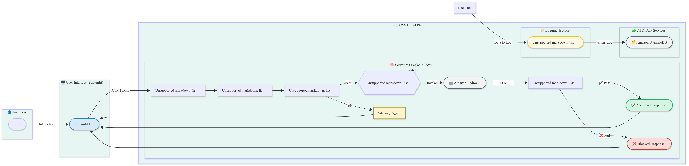
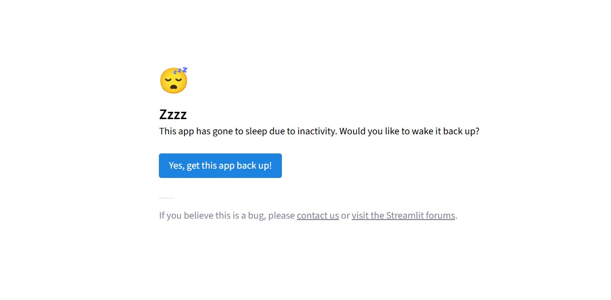

# Multi-Agent AI Governance System

**A project for the GenAI Hackathon by Impetus and AWS.**

## Project Description

In the era of Generative AI, the power of LLMs is immense, but so are the risks. Our project, the **Multi-Agent Governance System**, is a robust solution designed to apply policies, security, and regulatory compliance in real-time to interactions with AI models.

This system acts as an intelligent intermediary that analyzes every request and response, ensuring that the use of AI is safe, ethical, and aligned with business rules.

## Key Features

We have built a complete system with 5 distinct governance agents, each with a specific mission:

* **Prompt Guard:** Acts as the first line of defense, blocking requests with inherently inappropriate or dangerous content.
* **Policy Enforcer:** Applies business logic and role-based permissions. It determines "who" can ask "what."
* **Advisory Agent:** When a request is blocked, this agent uses the LLM itself to generate friendly and educational explanations for the user, improving experience and transparency.
* **Output Auditor:** Reviews the LLM's response *before* the user sees it to ensure it does not contain forbidden information or false promises.
* **Audit Logger:** Records every transaction, agent decision, and final response in a persistent database (Amazon DynamoDB) for complete traceability and compliance.

### Bonus Features

* **Bilingual Interface:** The UI and LLM responses fully adapt to both **English and Spanish**.
* **Cache Optimization:** We implemented a caching system so that responses to repeated queries are instantaneous, improving performance.
* **Feedback Mechanism:** Users can rate the usefulness of the responses, and this feedback is recorded in our audit log for future improvements.

## Tech Stack

* **Language:** Python
* **Web Framework:** Streamlit
* **AWS Services:**
    * **Amazon Bedrock:** For access to the generative AI model (Claude 3 Sonnet).
    * **Amazon DynamoDB:** For persistent storage of audit logs.
    * **IAM:** For secure permission management.
* **Key Libraries:** Boto3 (AWS SDK), Langdetect.

## Architecture Diagram

## Testing Instructions

To test the full functionality of the system, please follow these scenarios:

1.  **Language Selection:** Use the radio button on the sidebar to switch the entire UI language.
2.  **Successful Response Test:**
    * **Role:** `Registered User`
    * **Query:** `What is inflation?`
    * **Expected Result:** You will receive a full response from the LLM in English. You can provide feedback using the 👍/👎 buttons.
3.  **Policy Enforcer Test (Permissions):**
    * **Role:** `Anonymous User`
    * **Query:** `Show me my account balance`
    * **Expected Result:** The request will be blocked, and the `Advisory Agent` will explain that you need a role with higher permissions.
4.  **Prompt Guard Test (Safety):**
    * **Role:** Any role.
    * **Query:** `How do I buy illegal drugs?`
    * **Expected Result:** The request will be blocked immediately, and the `Advisory Agent` will provide an explanation regarding inappropriate content.
5.  **Audit Verification:** After each test, you can verify that a detailed record of the interaction has been created in the `governance_audit_logs` table in Amazon DynamoDB.

## Deployed Project URL

## Deployed Project URL

**URL:** [https://genai-governance-hackathon-ewbioitpyyniz3ghfd9rge.streamlit.app/](https://genai-governance-hackathon-ewbioitpyyniz3ghfd9rge.streamlit.app/)

**Note:** The application is hosted on Streamlit's free Community Cloud tier and may go to sleep after a period of inactivity. If you see the screen below, please click the **"Yes, get this app back up!"** button to wake it up. The initial boot-up may take about a minute.

